# 3. Поведение

Всички сценарии съответстват на кода. Пътят на един пакет е: `Transport` (приема и класифицира) -> `control` (заявки) или бърз път (данни) -> `RegistryActor` / `AllocationActor`.

## 3.1 Пътят на една датаграма

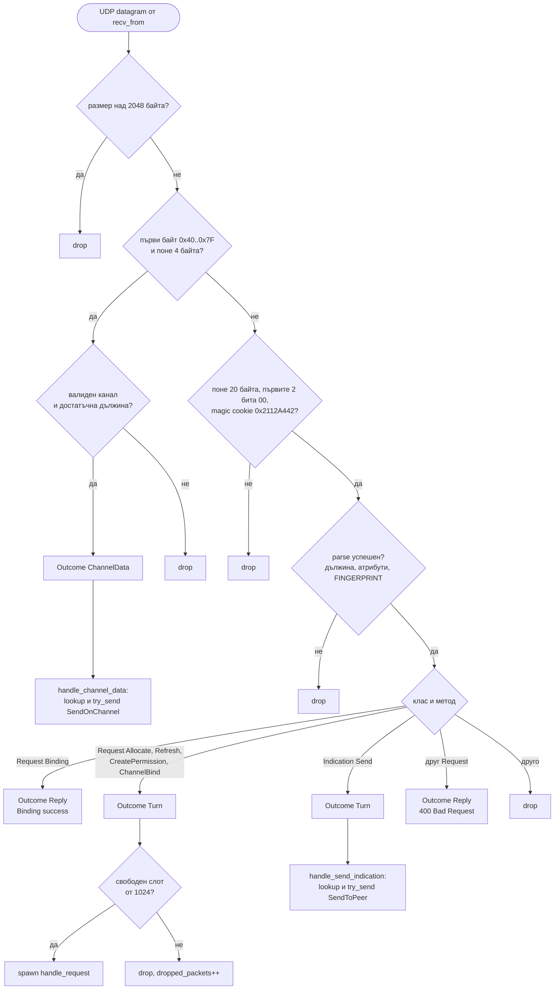
```mermaid
flowchart TD
    S(["UDP datagram от recv_from"]) --> L{"размер над 2048 байта?"}
    L -->|"да"| D0["drop"]
    L -->|"не"| CD{"първи байт 0x40..0x7F<br/>и поне 4 байта?"}
    CD -->|"да"| PC{"валиден канал<br/>и достатъчна дължина?"}
    PC -->|"да"| OCD["Outcome ChannelData"]
    PC -->|"не"| D1["drop"]
    CD -->|"не"| ST{"поне 20 байта, първите 2 бита 00,<br/>magic cookie 0x2112A442?"}
    ST -->|"не"| D2["drop"]
    ST -->|"да"| PA{"parse успешен?<br/>дължина, атрибути, FINGERPRINT"}
    PA -->|"не"| D3["drop"]
    PA -->|"да"| M{"клас и метод"}
    M -->|"Request Binding"| RB["Outcome Reply<br/>Binding success"]
    M -->|"Request Allocate, Refresh,<br/>CreatePermission, ChannelBind"| TQ["Outcome Turn"]
    M -->|"Indication Send"| TI["Outcome Turn"]
    M -->|"друг Request"| R4["Outcome Reply<br/>400 Bad Request"]
    M -->|"друго"| D4["drop"]
    OCD --> F1["handle_channel_data:<br/>lookup и try_send SendOnChannel"]
    TQ --> SEM{"свободен слот<br/>от 1024?"}
    SEM -->|"да"| SP["spawn handle_request"]
    SEM -->|"не"| D5["drop, dropped_packets++"]
    TI --> F2["handle_send_indication:<br/>lookup и try_send SendToPeer"]
```

## 3.2 STUN Binding

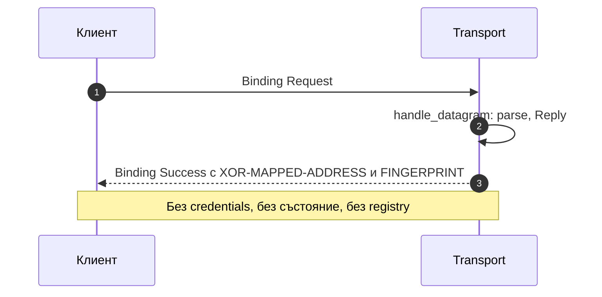
```mermaid
sequenceDiagram
    autonumber
    participant C as Клиент
    participant T as Transport
    C->>T: Binding Request
    T->>T: handle_datagram: parse, Reply
    T-->>C: Binding Success с XOR-MAPPED-ADDRESS и FINGERPRINT
    Note over C,T: Без credentials, без състояние, без registry
```

## 3.3 Автентикация и Allocate

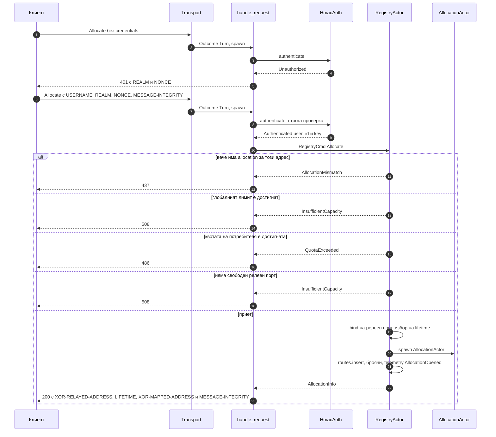
```mermaid
sequenceDiagram
    autonumber
    participant C as Клиент
    participant T as Transport
    participant H as handle_request
    participant A as HmacAuth
    participant R as RegistryActor
    participant L as AllocationActor

    C->>T: Allocate без credentials
    T->>H: Outcome Turn, spawn
    H->>A: authenticate
    A-->>H: Unauthorized
    H-->>C: 401 с REALM и NONCE

    C->>T: Allocate с USERNAME, REALM, NONCE, MESSAGE-INTEGRITY
    T->>H: Outcome Turn, spawn
    H->>A: authenticate, строга проверка
    A-->>H: Authenticated user_id и key
    H->>R: RegistryCmd Allocate
    alt вече има allocation за този адрес
        R-->>H: AllocationMismatch
        H-->>C: 437
    else глобалният лимит е достигнат
        R-->>H: InsufficientCapacity
        H-->>C: 508
    else квотата на потребителя е достигната
        R-->>H: QuotaExceeded
        H-->>C: 486
    else няма свободен релеен порт
        R-->>H: InsufficientCapacity
        H-->>C: 508
    else приет
        R->>R: bind на релеен порт, избор на lifetime
        R->>L: spawn AllocationActor
        R->>R: routes.insert, броячи, telemetry AllocationOpened
        R-->>H: AllocationInfo
        H-->>C: 200 с XOR-RELAYED-ADDRESS, LIFETIME, XOR-MAPPED-ADDRESS и MESSAGE-INTEGRITY
    end
```

Правила при приемане: `lifetime = LIFETIME от заявката`, а при липса или `0` се взема `ALLOCATION_LIFETIME_SECS`; най-много 600 s. `REQUESTED-TRANSPORT` трябва да е UDP (17), иначе е `400` и до registry не се стига.

## 3.4 CreatePermission, Send и Data indication

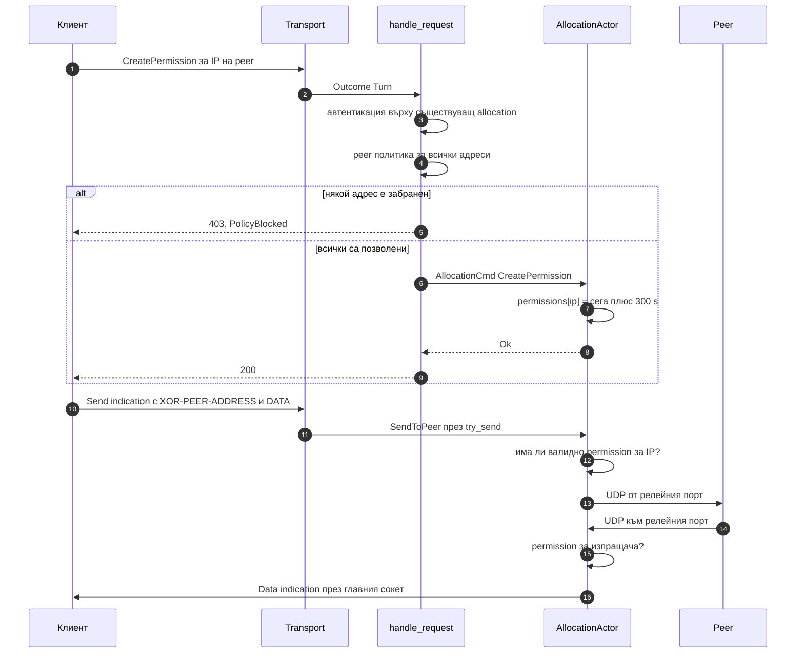
```mermaid
sequenceDiagram
    autonumber
    participant C as Клиент
    participant T as Transport
    participant H as handle_request
    participant L as AllocationActor
    participant P as Peer

    C->>T: CreatePermission за IP на peer
    T->>H: Outcome Turn
    H->>H: автентикация върху съществуващ allocation
    H->>H: peer политика за всички адреси
    alt някой адрес е забранен
        H-->>C: 403, PolicyBlocked
    else всички са позволени
        H->>L: AllocationCmd CreatePermission
        L->>L: permissions[ip] = сега плюс 300 s
        L-->>H: Ok
        H-->>C: 200
    end

    C->>T: Send indication с XOR-PEER-ADDRESS и DATA
    T->>L: SendToPeer през try_send
    L->>L: има ли валидно permission за IP?
    L->>P: UDP от релейния порт
    P->>L: UDP към релейния порт
    L->>L: permission за изпращача?
    L->>C: Data indication през главния сокет
```

Пакет без permission се пуска (`dropped_packets`). Send indication няма отговор по протокол.

## 3.5 ChannelBind и ChannelData

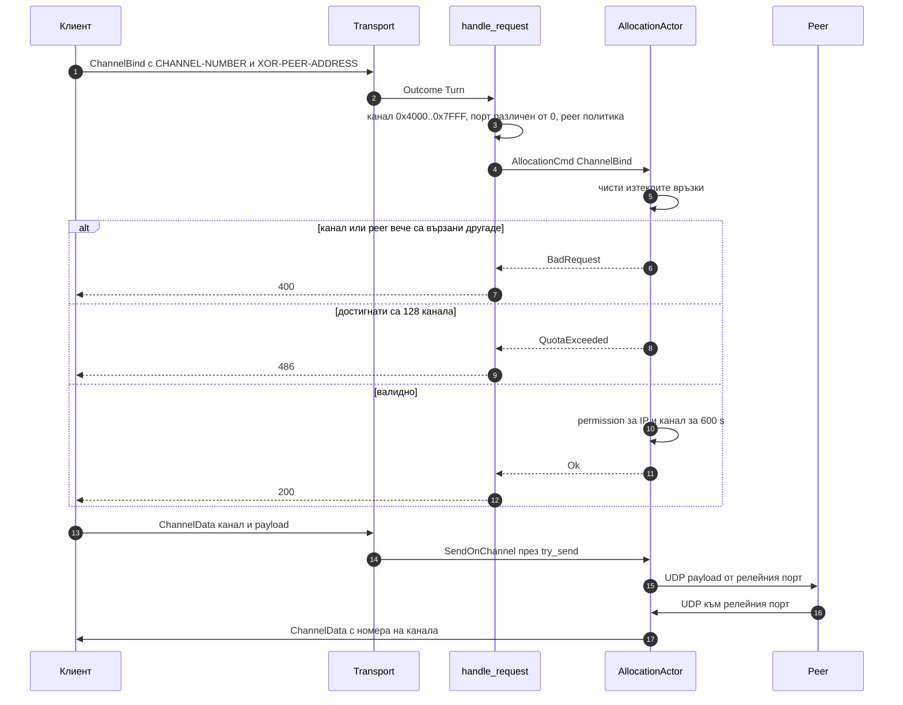
```mermaid
sequenceDiagram
    autonumber
    participant C as Клиент
    participant T as Transport
    participant H as handle_request
    participant L as AllocationActor
    participant P as Peer

    C->>T: ChannelBind с CHANNEL-NUMBER и XOR-PEER-ADDRESS
    T->>H: Outcome Turn
    H->>H: канал 0x4000..0x7FFF, порт различен от 0, peer политика
    H->>L: AllocationCmd ChannelBind
    L->>L: чисти изтеклите връзки
    alt канал или peer вече са вързани другаде
        L-->>H: BadRequest
        H-->>C: 400
    else достигнати са 128 канала
        L-->>H: QuotaExceeded
        H-->>C: 486
    else валидно
        L->>L: permission за IP и канал за 600 s
        L-->>H: Ok
        H-->>C: 200
    end

    C->>T: ChannelData канал и payload
    T->>L: SendOnChannel през try_send
    L->>P: UDP payload от релейния порт
    P->>L: UDP към релейния порт
    L->>C: ChannelData с номера на канала
```

Повторен `ChannelBind` със същата двойка канал и peer я подновява. Ако за peer няма жив канал, обратният трафик тръгва като Data indication.

## 3.6 Refresh и изтриване

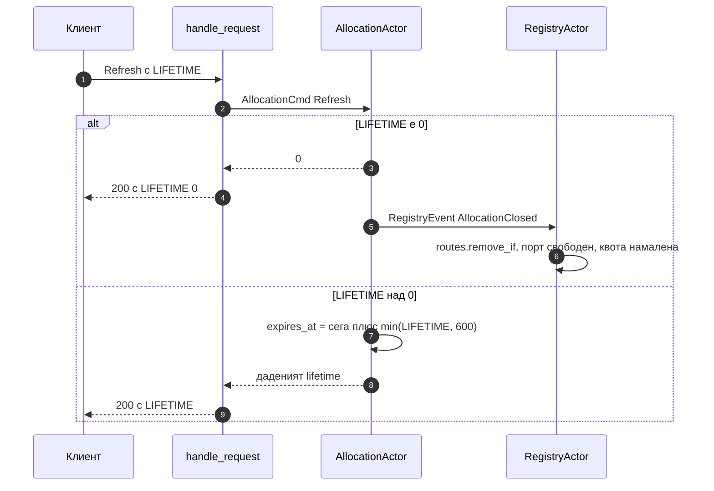
```mermaid
sequenceDiagram
    autonumber
    participant C as Клиент
    participant H as handle_request
    participant L as AllocationActor
    participant R as RegistryActor

    C->>H: Refresh с LIFETIME
    H->>L: AllocationCmd Refresh
    alt LIFETIME е 0
        L-->>H: 0
        H-->>C: 200 с LIFETIME 0
        L->>R: RegistryEvent AllocationClosed
        R->>R: routes.remove_if, порт свободен, квота намалена
    else LIFETIME над 0
        L->>L: expires_at = сега плюс min(LIFETIME, 600)
        L-->>H: даденият lifetime
        H-->>C: 200 с LIFETIME
    end
```

## 3.7 Изтичане на allocation

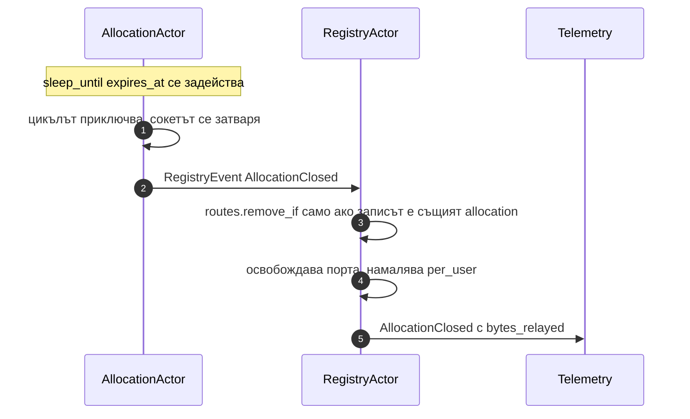
```mermaid
sequenceDiagram
    autonumber
    participant L as AllocationActor
    participant R as RegistryActor
    participant TEL as Telemetry

    Note over L: sleep_until expires_at се задейства
    L->>L: цикълът приключва, сокетът се затваря
    L->>R: RegistryEvent AllocationClosed
    R->>R: routes.remove_if само ако записът е същият allocation
    R->>R: освобождава порта, намалява per_user
    R->>TEL: AllocationClosed с bytes_relayed
```

Следващ пакет за този адрес не намира маршрут и се пуска; следваща заявка получава `437`.

## 3.8 Дълъг разговор и изтекли credentials

Подробно обяснение и диаграма: [Замяна на coturn, 6.3](06-coturn-migration.md#63-точка-3-дълги-разговори). Накратко: съществуващ allocation се подновява и с изтекли credentials до `CREDENTIAL_GRACE_SECS`, но само от своя собственик; нов allocation с изтекли credentials е винаги `401`.

## 3.9 Плавно спиране

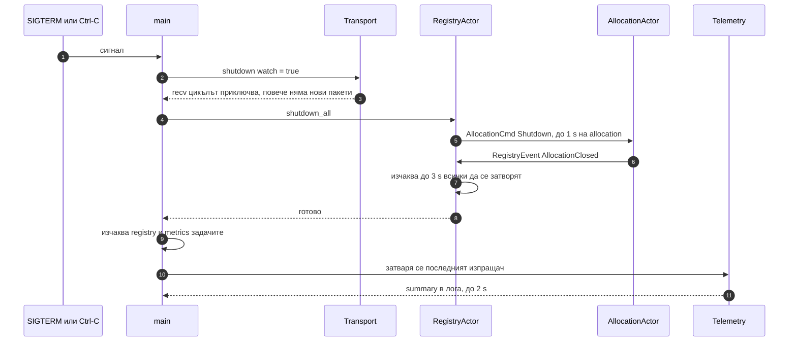
```mermaid
sequenceDiagram
    autonumber
    participant OS as SIGTERM или Ctrl-C
    participant M as main
    participant T as Transport
    participant R as RegistryActor
    participant L as AllocationActor
    participant TEL as Telemetry

    OS->>M: сигнал
    M->>T: shutdown watch = true
    T-->>M: recv цикълът приключва, повече няма нови пакети
    M->>R: shutdown_all
    R->>L: AllocationCmd Shutdown, до 1 s на allocation
    L->>R: RegistryEvent AllocationClosed
    R->>R: изчаква до 3 s всички да се затворят
    R-->>M: готово
    M->>M: изчаква registry и metrics задачите
    M->>TEL: затваря се последният изпращач
    TEL-->>M: summary в лога, до 2 s
```

## 3.10 Метрики

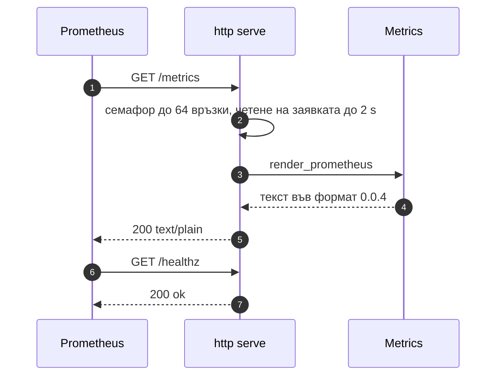
```mermaid
sequenceDiagram
    autonumber
    participant P as Prometheus
    participant H as http serve
    participant MET as Metrics

    P->>H: GET /metrics
    H->>H: семафор до 64 връзки, четене на заявката до 2 s
    H->>MET: render_prometheus
    MET-->>H: текст във формат 0.0.4
    H-->>P: 200 text/plain
    P->>H: GET /healthz
    H-->>P: 200 ok
```

## 3.11 Издаване на credentials

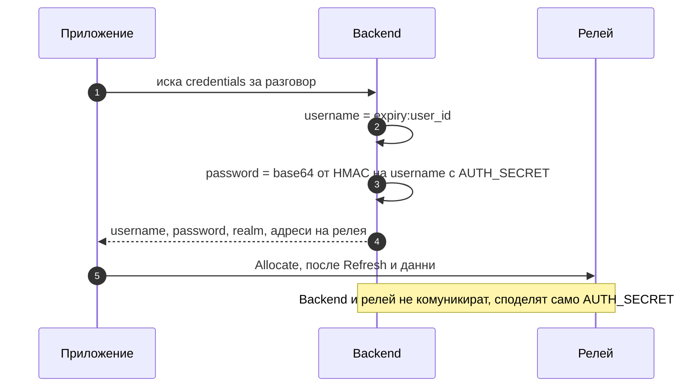
```mermaid
sequenceDiagram
    autonumber
    participant APP as Приложение
    participant BE as Backend
    participant R as Релей

    APP->>BE: иска credentials за разговор
    BE->>BE: username = expiry:user_id
    BE->>BE: password = base64 от HMAC на username с AUTH_SECRET
    BE-->>APP: username, password, realm, адреси на релея
    APP->>R: Allocate, после Refresh и данни
    Note over BE,R: Backend и релей не комуникират, споделят само AUTH_SECRET
```

Същото прави командата `stun-turn-relay mint-credentials <user_id> [ttl]` за ръчни тестове.

## 3.12 Жизнен цикъл на allocation

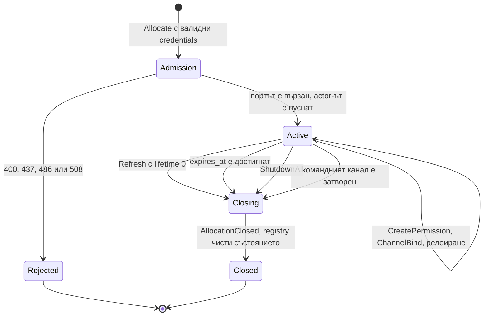
```mermaid
stateDiagram-v2
    [*] --> Admission : Allocate с валидни credentials
    Admission --> Rejected : 400, 437, 486 или 508
    Admission --> Active : портът е вързан, actor-ът е пуснат
    Active --> Active : Refresh с lifetime 1..600
    Active --> Active : CreatePermission, ChannelBind, релеиране
    Active --> Closing : Refresh с lifetime 0
    Active --> Closing : expires_at е достигнат
    Active --> Closing : ShutdownAll
    Active --> Closing : командният канал е затворен
    Closing --> Closed : AllocationClosed, registry чисти състоянието
    Rejected --> [*]
    Closed --> [*]
```

## 3.13 Жизнен цикъл на permission

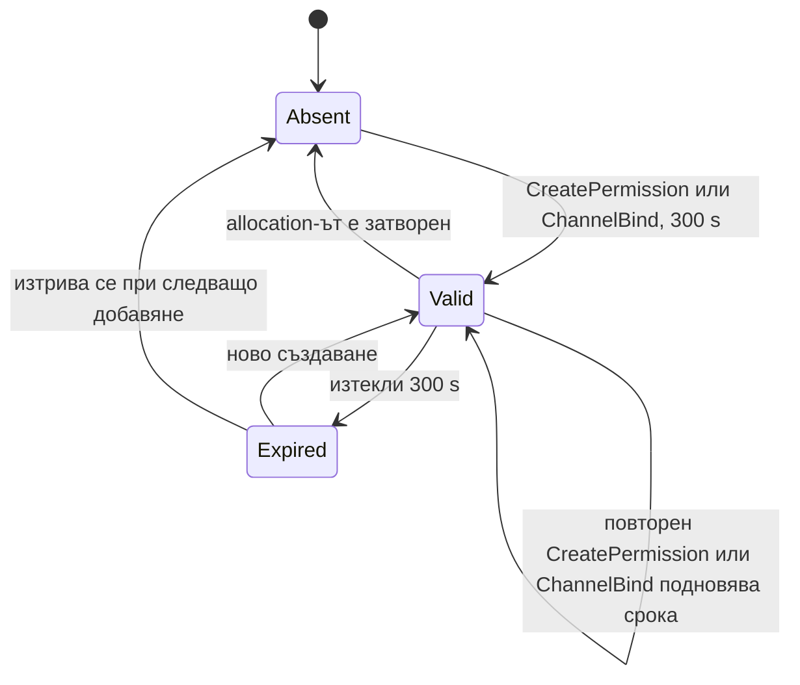
```mermaid
stateDiagram-v2
    [*] --> Absent
    Absent --> Valid : CreatePermission или ChannelBind, 300 s
    Valid --> Valid : повторен CreatePermission или ChannelBind подновява срока
    Valid --> Expired : изтекли 300 s
    Expired --> Valid : ново създаване
    Expired --> Absent : изтрива се при следващо добавяне
    Valid --> Absent : allocation-ът е затворен
```

Пакет се релеира само във състояние `Valid`. Изтекъл запис се третира като липсващ веднага и физически се премахва при следващо добавяне.

## 3.14 Жизнен цикъл на channel binding

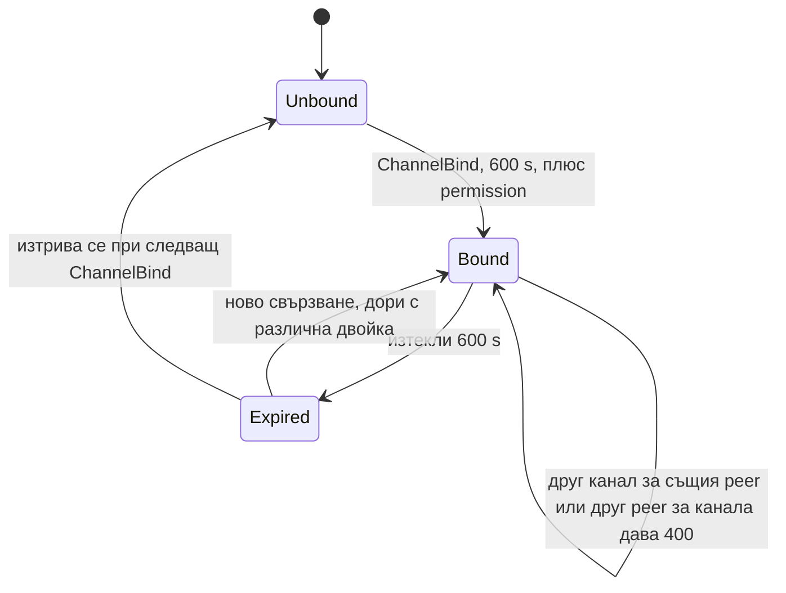
```mermaid
stateDiagram-v2
    [*] --> Unbound
    Unbound --> Bound : ChannelBind, 600 s, плюс permission
    Bound --> Bound : същата двойка канал и peer подновява срока
    Bound --> Bound : друг канал за същия peer или друг peer за канала дава 400
    Bound --> Expired : изтекли 600 s
    Expired --> Bound : ново свързване, дори с различна двойка
    Expired --> Unbound : изтрива се при следващ ChannelBind
```

## 3.15 Жизнен цикъл на процеса

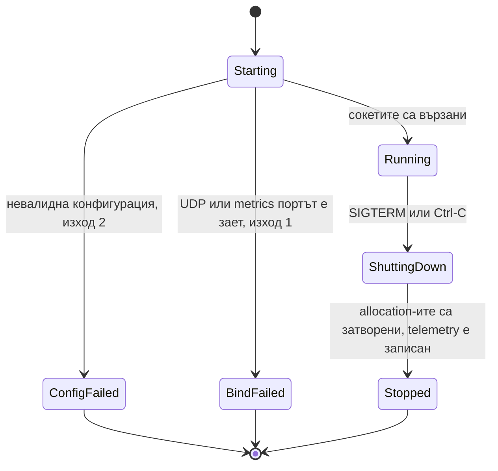
```mermaid
stateDiagram-v2
    [*] --> Starting
    Starting --> ConfigFailed : невалидна конфигурация, изход 2
    Starting --> BindFailed : UDP или metrics портът е зает, изход 1
    Starting --> Running : сокетите са вързани
    Running --> ShuttingDown : SIGTERM или Ctrl-C
    ShuttingDown --> Stopped : allocation-ите са затворени, telemetry е записан
    ConfigFailed --> [*]
    BindFailed --> [*]
    Stopped --> [*]
```

## 3.16 Данните: клиент към peer

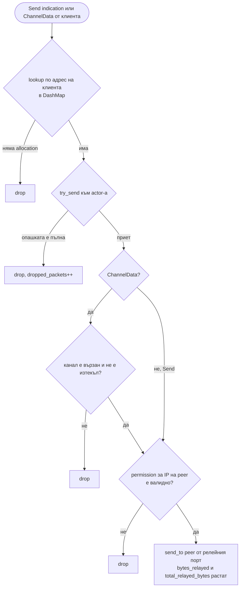
```mermaid
flowchart TD
    A(["Send indication или ChannelData от клиента"]) --> L{"lookup по адрес на клиента<br/>в DashMap"}
    L -->|"няма allocation"| D1["drop"]
    L -->|"има"| Q{"try_send към actor-а"}
    Q -->|"опашката е пълна"| D2["drop, dropped_packets++"]
    Q -->|"приет"| CH{"ChannelData?"}
    CH -->|"да"| PC{"канал е вързан и не е изтекъл?"}
    PC -->|"не"| D3["drop"]
    PC -->|"да"| PE
    CH -->|"не, Send"| PE{"permission за IP на peer<br/>е валидно?"}
    PE -->|"не"| D4["drop"]
    PE -->|"да"| SND["send_to peer от релейния порт<br/>bytes_relayed и total_relayed_bytes растат"]
```

## 3.17 Данните: peer към клиент

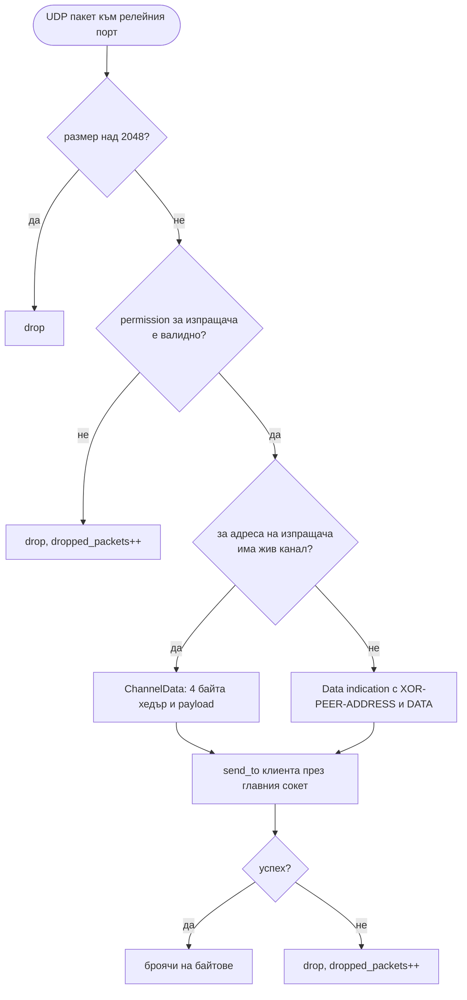
```mermaid
flowchart TD
    A(["UDP пакет към релейния порт"]) --> S{"размер над 2048?"}
    S -->|"да"| D1["drop"]
    S -->|"не"| P{"permission за изпращача<br/>е валидно?"}
    P -->|"не"| D2["drop, dropped_packets++"]
    P -->|"да"| C{"за адреса на изпращача<br/>има жив канал?"}
    C -->|"да"| CD["ChannelData: 4 байта хедър и payload"]
    C -->|"не"| DI["Data indication с XOR-PEER-ADDRESS и DATA"]
    CD --> OUT["send_to клиента през главния сокет"]
    DI --> OUT
    OUT --> OK{"успех?"}
    OK -->|"да"| ACC["броячи на байтове"]
    OK -->|"не"| D3["drop, dropped_packets++"]
```
